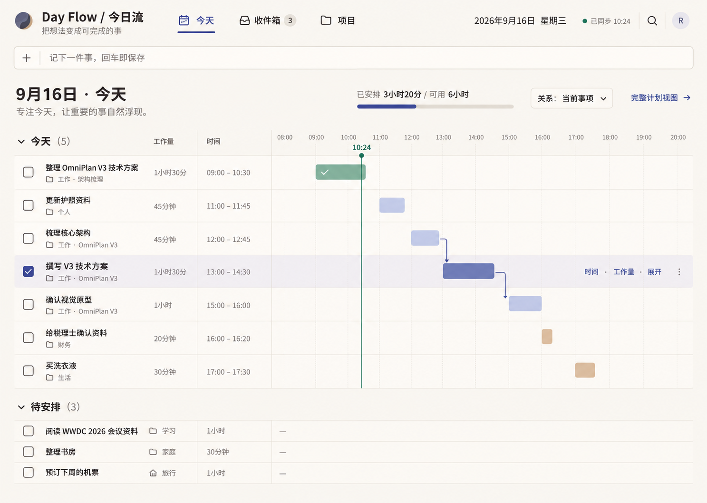
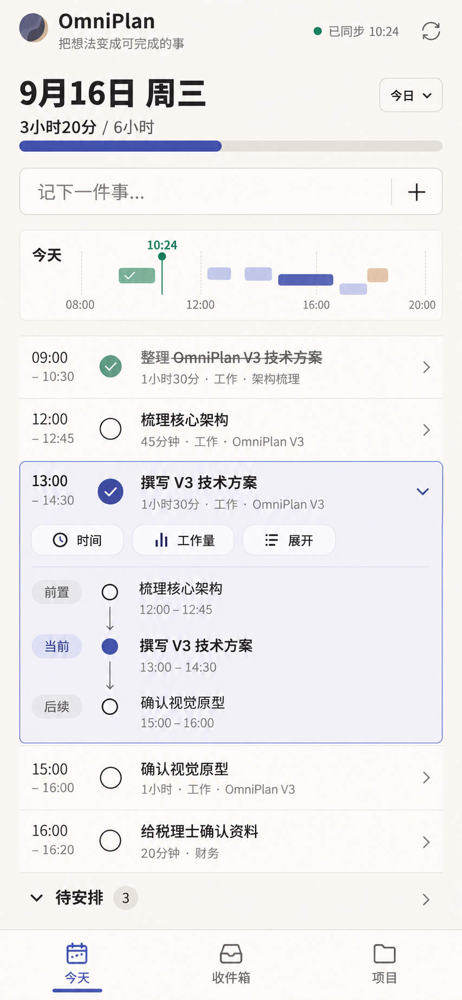

# OmniPlan Personal：Task-first 产品规格

**状态：** 本地实现完成，待 HTTPS 部署后的双设备验收  
**日期：** 2026-09-16  
**适用平台：** Mac Chrome、iPhone 主屏幕 Web App（Safari 添加到主屏幕）  
**产品形态：** 私人使用的响应式 PWA，不依赖 App Store 分发

实施拆分与本地进度见：[Task-first 实施计划](./implementation-plan.md)。

## 1. 文档地位

本规格是 OmniPlan 当前产品方向的事实来源。出现冲突时，本规格优先于：

- `docs/fluent-design-migration-plan.md`：保留为历史视觉探索，不再执行 Fluent 迁移。
- `docs/superpowers/specs/2026-07-10-omniplan-enforced-lifecycle-v2-design.md`：保留其中可靠的调度、审查、证据和安全约束，但不再让完整生命周期成为所有工作的默认入口。
- 现有 Portfolio、Audit、Reports 等页面的导航地位：能力保留，入口降级到项目或按需展开区域。

这里的 “Task-first” 是产品体验原则，不等同于当前 `WorkspaceSnapshot.schemaVersion`。

## 2. 产品结论

OmniPlan 不是一个要求用户先理解项目管理方法的系统，而是一个可以立即记录、随后逐步变得有结构的个人任务系统。

核心承诺：

> 所有内容先成为一个能瞬间保存的任务；时间、工作量、项目、依赖、Gantt、资源和审查只在需要时展开。

用户打开产品时，首先应该回答三个问题：

1. 我刚想到的事情能否马上记下？
2. 今天从早到晚怎么安排，容量是否已经超出？
3. 当前事项被什么阻塞，完成后会解锁什么？

## 3. 目标用户与问题

### 3.1 目标用户

- 单人使用，不以团队协作为核心。
- 同时处理个人事务、工作任务和少量复杂项目。
- 在 Mac 上进行规划，在 iPhone 上进行捕捉、查看和完成。
- 需要 OmniPlan 级别的依赖、Gantt 和资源能力，但不希望每次记录都经过项目管理流程。

### 3.2 当前问题

- 新增一项事情需要经过太多字段或弹窗，记录完成时可能已经忘记重点。
- 「今天」由 Todo、项目任务、提醒和审查信号分散组成，不能一眼看出全天安排。
- 时间约束和工作量混在复杂项目结构里，日常任务难以快速规划。
- Gantt、资源、审查等高级能力过早暴露，使简单任务显得沉重。
- PWA 已有离线外壳，但没有完整 Web Push。
- Shortcut 与 Alfred 依赖原生 Companion，不符合“不做 App”的最终形态，也增加了配置成本。

## 4. 产品原则

### 4.1 捕捉先于整理

- 唯一必填字段是标题。
- 回车立即保存；日期、时间、工作量、标签和项目均不阻塞保存。
- 保存先发生在本地，再异步同步。
- 解析自然语言、推荐时间或项目归属只能发生在保存之后。

### 4.2 一个任务，逐步增加结构

- 捕捉后仍是同一个任务，不因为加入项目而复制、替换或丢失历史。
- 加入项目只是增加组织关系。
- 添加依赖、资源或完整计划时，再展开相应能力。

### 4.3 时间与工作量是两个概念

- **时间**：任务计划在一天中的哪个时段发生。
- **工作量**：完成任务预计需要投入多久或多少注意力。
- 两者可以不同，例如 13:00–14:00 的会议占用 1 小时时间，但准备工作量可另行记录。

### 4.4 默认只展示当前上下文

- Today 默认只展示当天任务、容量和当前时间。
- 选中任务后，只展示它的直接前置与直接后续。
- 完整依赖网络、关键路径、Gantt、资源负载和审查历史只在 Project 中显示。

### 4.5 复杂度不得泄漏到捕捉流程

- 任何审查、证据、Bet、资源或项目字段都不能成为快速记录的前置条件。
- 高级规则可以阻止项目执行，但不能阻止记录一个想法。

## 5. 信息架构

一级导航只有三个目的地：

1. **今天**：默认首页；全天安排、容量、执行和直接依赖。
2. **收件箱**：尚未安排或需要整理的任务。
3. **项目**：需要结构化管理的工作。

辅助入口：

- 搜索：桌面顶栏；移动端从 Today 或菜单进入。
- 设置：桌面右上角/侧边工具区；移动端项目或个人菜单内。
- 审查：Projects 内的聚合入口；存在必须处理的问题时，在 Today 显示一条简洁提示。
- 报告、证据、自动化：进入具体项目后按需展开。

不再作为一级导航：Portfolio、Calendar、Audit、Reports、Agent。

## 6. 核心对象

### 6.1 Task

用户面对的唯一工作对象名称。最小 Task 仅包含：

- `id`
- `title`
- `capturedAt`
- `status`

按需增加：

- `note`
- `estimateSeconds`：工作量
- `plannedStart` / `plannedFinish`：时间安排
- `dueAt`
- `projectId`
- `parentId`
- `tags`
- `checklist`
- `repeatRule`
- `assignment`
- `dependencies`
- `actuals`

实现时可以先用统一投影兼容现有 `Todo` 与 `WorkItem`，不要求第一阶段立刻重写存储结构；但界面、命令和测试必须以 Task 作为统一语言。

### 6.2 Project

Project 是一组需要持续组织的 Task。只有用户主动使用以下能力时，才需要 Project：

- 层级拆分或阶段；
- 任务依赖；
- Gantt 与基线；
- 多资源分配或负载平衡；
- 项目级证据、审查或报告。

从 Task 创建 Project 时，应保留原 Task 的 ID、标题、说明、时间、工作量、完成状态和来源历史。

### 6.3 Day Plan

某一天的视图投影，不复制 Task：

- 当日可用容量；
- 已安排时间块；
- 已安排工作量；
- 未安排候选项；
- 当前时间；
- 直接依赖状态。

## 7. 关键流程

### 7.1 瞬间记录

1. 用户聚焦“记下一件事…”输入框。
2. 输入标题并回车。
3. Task 立即进入本地 Workspace，并出现在当前列表或收件箱。
4. 界面清空输入框，显示短暂的“已保存 · 撤销”。
5. 后台尝试解析日期、时间和工作量，但不自动改变用户承诺；解析结果以建议形式出现。
6. 同步失败时任务仍保留，并显示安静的待同步状态。

捕捉入口：

- Today 和 Inbox 顶部常驻输入框；
- Web App 内键盘快捷键；
- iPhone Shortcut；
- Mac Alfred；
- Web Share Target。

### 7.2 安排今天

1. 未安排 Task 位于“待安排”。
2. 用户为 Task 设置时间和工作量，或将其放入时间轴。
3. Today 立即更新已安排/可用容量。
4. 超出容量时使用琥珀色提示，但不阻止用户保存。
5. 固定时间与弹性任务视觉上可区分；第一版无需自动重排全部任务。

### 7.3 查看依赖

1. 用户选择一条属于 Project 的 Task。
2. Today 仅显示直接前置、当前 Task、直接后续。
3. 已完成前置使用鼠尾草绿；阻塞或冲突使用琥珀色。
4. 用户选择“完整计划视图”后才进入 Project Gantt/Network。

独立 Task 试图添加依赖时，界面在当下提供“选择项目”或“创建项目”，不会在最初捕捉时询问。

### 7.4 拆成项目

1. 从 Task 的“展开”菜单选择“拆成项目”。
2. 默认以 Task 标题作为 Project 名称，并把原 Task 作为首个可执行项。
3. 用户可随后添加阶段、子任务、依赖、资源和审查规则。
4. 转换过程必须可撤销，并保留历史。

### 7.5 完成与实际投入

- 点击完成是一级动作。
- 完成后可选填实际工作量和简短结果；不能用必填表单阻塞完成。
- 对有证据要求的项目里程碑，证据规则仍可在 Project 内生效。

## 8. Today：桌面布局

视觉基准：

结构：

- 顶部：品牌、三个一级入口、日期、同步状态和搜索。
- 第二行：横跨页面的快速记录输入框。
- 标题区：日期、已安排/可用容量、依赖显示范围和“完整计划视图”。
- 主区：左侧任务名称与工作量，中央计划时间，右侧从 08:00–20:00 的时间轴。
- 已选 Task 整行轻微靛蓝高亮，并显示“时间 / 工作量 / 展开”快捷动作。
- 时间轴只连接已选 Task 的直接前置与后续，不绘制全局网络。
- 底部：“待安排”默认可折叠。

默认状态下不显示：Inspector、资源表、审查队列、完整关键路径、EVM、Monte Carlo 或报告。

## 9. Today：iPhone 布局

视觉基准：

移动端不是缩小后的桌面表格：

- 顶部显示日期、容量和快速记录。
- 使用压缩的日程概览条表示一天形状，只保留少量时间刻度。
- 主体为按时间排列的任务列表。
- 选中 Task 后，在原位置内联展开“前置 → 当前 → 后续”。
- 底部为“今天 / 收件箱 / 项目”三个带文字的入口。
- 所有主要触控目标至少 44 × 44 CSS px。

## 10. Inbox

Inbox 的职责只有“捕捉后暂存”和“稍后整理”：

- 首屏输入框与 Today 相同。
- 默认按捕捉时间倒序。
- 每行只暴露完成、安排时间、工作量和展开。
- 批量整理、标签、重复、Checklist 等放在展开区。
- 不强迫用户把每一项分类为 Action 或 Project。

## 11. Projects 与高级能力

Project 首页先显示：

- 项目名称和当前结果；
- 下一步；
- 当前进度与风险摘要；
- Task 列表。

随后按需进入：

- Outline；
- Gantt；
- Dependency Network；
- Resources；
- Review；
- Evidence / Reports。

资源默认只有“我”，不在普通 Task 上占据固定空间。添加第二个资源或打开资源视图后，再显示角色、注意力容量、工作量和冲突。

严格生命周期、Bet、证据门和审查仍可用于复杂或高风险 Project，但应作为项目模板/模式启用，而不是全局默认。

## 12. 通知与 PWA

### 12.1 支持范围

- Mac Chrome：标准 Web Push。
- iPhone：从 Safari 添加到主屏幕后，以 Home Screen Web App 请求通知权限。
- 权限只在用户主动点击“开启通知”后请求。
- 不做浏览器名称判断，使用能力检测与渐进增强。

Apple 已确认 iOS/iPadOS 16.4 起，加入主屏幕的 Web App 可使用标准 Web Push，且无需加入 Apple Developer Program：

- <https://webkit.org/blog/13878/web-push-for-web-apps-on-ios-and-ipados/>
- <https://webkit.org/blog/16535/meet-declarative-web-push/>

### 12.2 通知类型

第一版只发送真正有行动价值的通知：

- 固定时间 Task 即将开始；
- 到期提醒；
- 被等待的前置任务完成，从而解锁当前 Task；
- 同步或外部捕捉连续失败，需要用户处理。

默认不发送：普通同步成功、每次自动重排、无变化的每日摘要、所有项目审查噪音。

### 12.3 隐私策略

现有 Workspace 继续端到端加密。通知服务只保存最少的提醒信封：

- 随机 Task 引用；
- 触发时间；
- 目标设备订阅；
- 打开后的路由；
- 修订号和幂等键。

默认通知正文使用通用文本，例如“有一项计划即将开始”。用户可以明确选择在通知中显示 Task 标题；只有此时通知服务才接收该标题。

## 13. Shortcut 与 Alfred

两者使用同一个私人 Capture API，不再要求安装原生 OmniPlan Companion。

### 13.1 Capture API

- `POST /api/captures`
- 每个设备使用可撤销的独立 Token。
- 支持标题、说明、期望日期、计划时间和工作量；标题以外均可省略。
- 使用幂等键避免 Shortcut/Alfred 重试导致重复。
- 服务端写入独立 Capture Inbox，不直接改写加密 Workspace。
- Web App 拉取后合并进本地 Workspace、完成加密同步并确认消费。
- 已消费记录立即删除；未消费记录使用有限保留期。

这是“不安装 App”与“外部工具可后台捕捉”之间的明确折中：外部捕捉内容会短暂经过私人服务。设置页必须说明这一点，并允许关闭 Capture API。

### 13.2 iPhone Shortcut

- 接受文本、分享内容或语音听写结果。
- 调用 Capture API 后显示“已记录”或明确失败。
- 可选参数：时间、工作量、说明。
- Shortcut 中的 Token 视为密码，不得随分享导出。

### 13.3 Alfred

- `oa <内容>` 直接记录。
- 支持简洁单行语法，例如 `oa 买牛奶` 或 `oa 写方案 | 说明 | 2026-09-18 14:00 | 1.5h`。
- 网络失败时进入本地重试队列并给出可理解反馈。
- Alfred 配置页仅需要服务地址和设备 Token。

## 14. 技术方向

### 14.1 前端

- 保留 React、TypeScript、Vite、Tailwind CSS。
- 保留现有 Radix/shadcn-compatible 基础组件和 `lucide-react` 图标。
- 不引入 Fluent 组件系统。
- 将 `App.tsx` 中的页面与状态编排逐步拆到 feature 模块，不做一次性重写。

### 14.2 本地优先与同步

- 捕捉必须先写本地存储，网络不是成功条件。
- 保留现有 Firebase E2EE Workspace 和冲突保护。
- 所有写入经过统一 Task Command 层，UI、Capture Inbox、导入和同步共享校验。
- 冲突不得静默覆盖；冲突提示移入 Review/设置，不打断普通捕捉。

### 14.3 推送服务

- 使用标准 Web Push + VAPID，而不是把核心能力绑定到仅部分浏览器支持的专有客户端抽象。
- 使用同域 Bun + SQLite 私人服务管理订阅、Capture Inbox 和最小提醒信封；它不解密 Workspace，Firebase E2EE 仍只负责工作区同步。
- Service Worker 负责接收、显示通知以及点击后打开对应日期/Task。

### 14.4 离线

- App Shell 可离线打开。
- 捕捉、完成和基础安排可离线进行并排队。
- Gantt 计算继续在客户端执行。
- 无网络时明确显示“已保存，等待同步”，不能显示失败后丢失的数据。

## 15. 视觉系统：温润工具

### 15.1 色彩

| 角色 | 色值 | 用途 |
| --- | --- | --- |
| Warm stone | `#F7F5F0` | 页面底色 |
| Ivory | `#FFFDFA` | 工作区与输入表面 |
| Warm charcoal | `#262522` | 主文字 |
| Muted taupe | `#76716A` | 次要信息 |
| Deep indigo | `#4A56A6` | 当前选择、主操作、计划块 |
| Sage | `#568C72` | 完成、健康状态 |
| Burnt amber | `#BD7A35` | 超负荷、风险、需要注意 |

红色只用于真实错误或破坏性操作，不用于普通延期提醒。

### 15.2 尺寸与形状

- 正文：15–16 px。
- 元数据：13 px。
- 日期标题：28–30 px。
- 桌面任务行：约 56 px。
- 顶部工具栏：约 50 px。
- 快速记录框：至少 44 px。
- 控件圆角：8 px。
- 时间条圆角：5 px。
- 图标：16–18 px 线性图标；不使用 Emoji 作为产品图标。

### 15.3 表面与密度

- 1 px 细边框建立层级。
- 几乎不使用阴影；禁止玻璃效果和渐变。
- 优先使用行、分隔线、对齐与留白，避免卡片套卡片。
- 精确、克制，保留 shadcn 的工具感，但避免后台管理系统气质。
- 全产品使用系统无衬线字体，不再使用编辑感强的 Georgia 标题。

## 16. 可访问性与响应式

- 键盘可完成捕捉、选择、安排、完成与展开。
- 焦点状态清晰，不只依赖颜色。
- 完成、阻塞和当前选择同时使用图形/文字语义。
- 路由变化后焦点进入页面标题。
- 对话框和 Sheet 正确捕获并恢复焦点。
- 200% 缩放不丢失主要操作。
- Gantt 和依赖图提供等价文本列表。
- 尊重 `prefers-reduced-motion`。

## 17. 体验指标

这些指标用于验收体验，不作为后台分析前提：

- 从输入开始到本地保存：一次回车，无第二个必填步骤。
- 常见设备上本地确认反馈目标：100 ms 内出现。
- 用户进入 Today 后，无需打开详情即可看见当天容量、时间顺序和未安排数量。
- 查看直接依赖：选择一次 Task 即可。
- 从普通 Task 进入完整 Gantt：最多两次明确操作。
- 快速记录失败不得导致文本丢失。

## 18. 产品验收标准

1. Today 和 Inbox 首屏均可仅凭标题立即创建 Task。
2. 捕捉不要求项目、日期、工作量、标签或审查信息。
3. 离线捕捉刷新后仍存在，并能在恢复网络后同步。
4. Today 将独立 Task 与 Project Task 合并在同一时间顺序中。
5. Today 同时显示计划时间和工作量，并明确展示当日容量。
6. 选中 Project Task 时只显示直接前置与后续。
7. 完整 Gantt、资源和审查不出现在 Today 默认状态。
8. Task 拆成 Project 后保留内容与历史。
9. 桌面实现与 `today-desktop.png` 保持结构和视觉一致。
10. 移动实现与 `today-mobile.png` 保持结构和视觉一致，而非缩小桌面表格。
11. Mac Chrome 可以订阅、接收并点击 Web Push。
12. iPhone 主屏幕 Web App 可以在用户主动授权后订阅、接收并点击 Web Push。
13. Shortcut 与 Alfred 无需原生 OmniPlan App 即可记录，并能防止重试重复。
14. 现有加密同步、冲突保护、调度、依赖、Gantt、资源、重复任务、EVM 和 Monte Carlo 能力不被破坏。
15. 既有 Work item 的 Title/Description 可编辑且刷新后保留。
