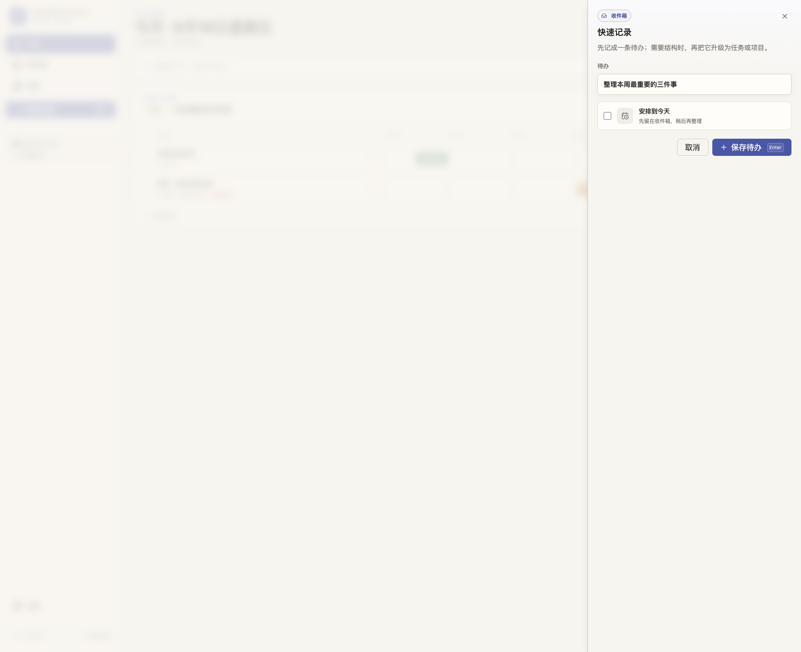
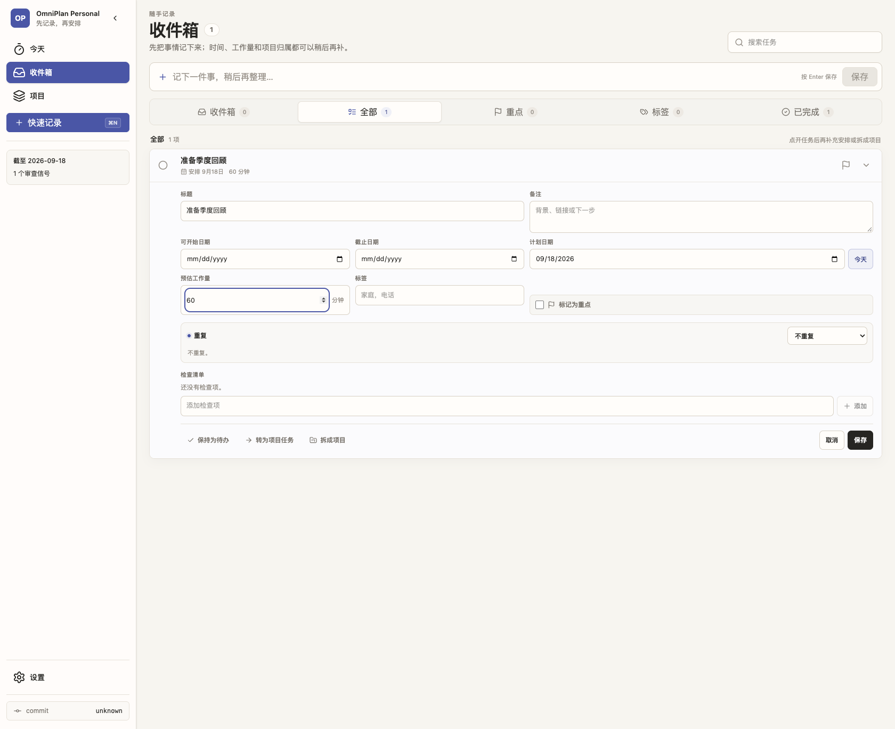
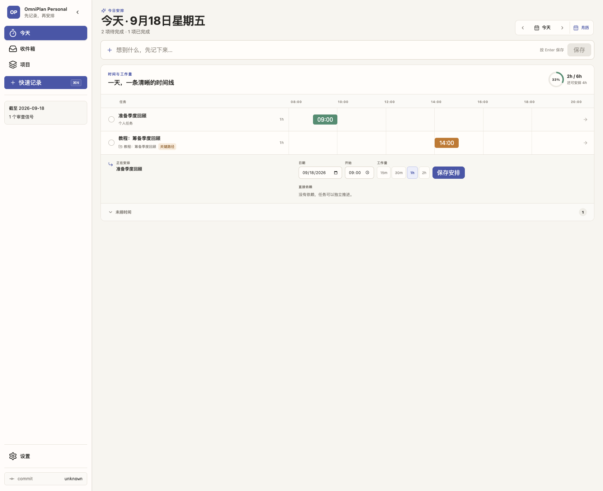
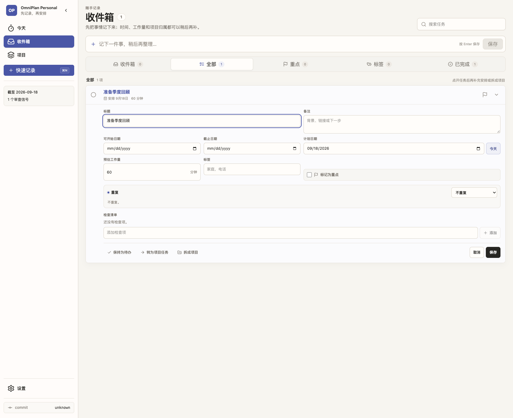
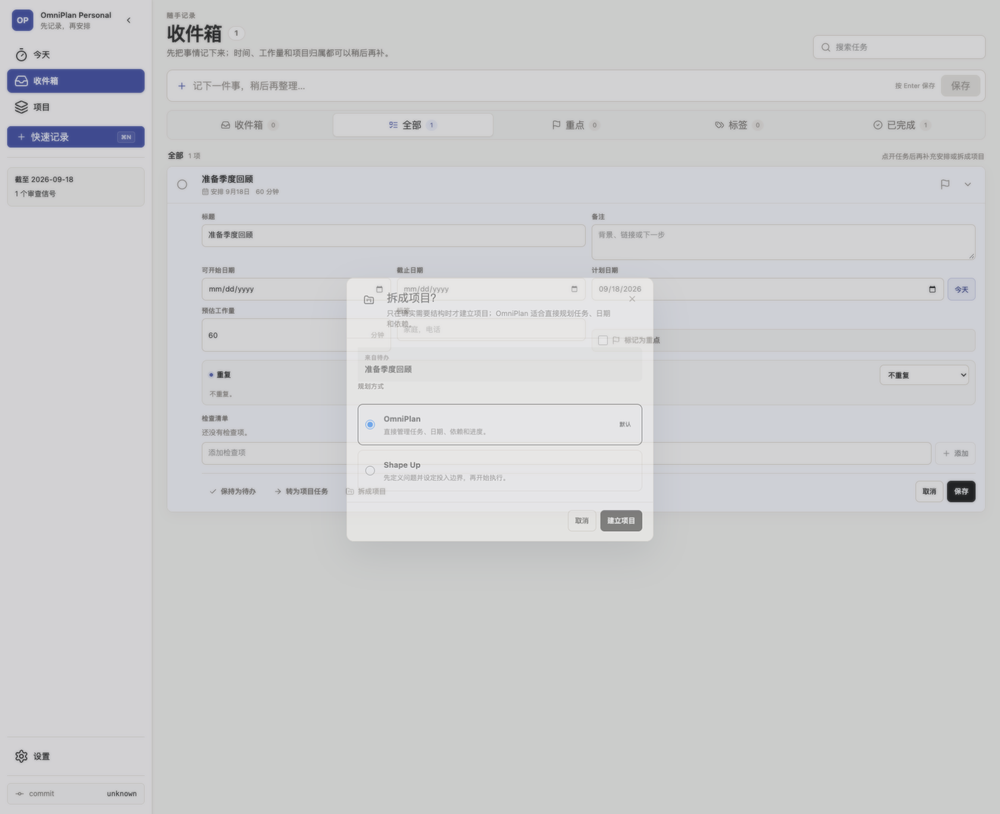
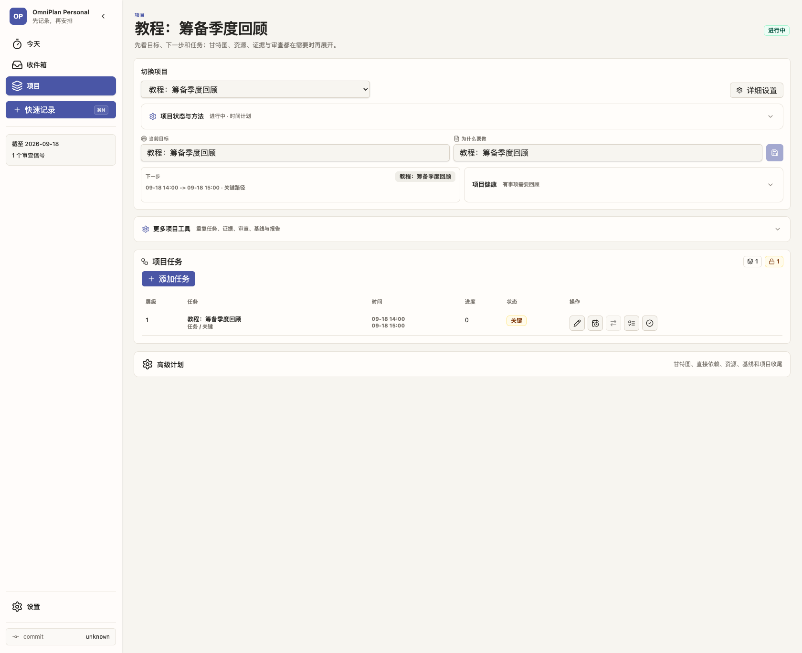

# 从随手记录到项目：6 步教程

这套流程只有一个默认动作：先把事情记下来。日期、工作量、具体时间、项目结构和高级计划都可以稍后按需补充。

## 1. 一句话保存

点击左侧的「快速记录」，或按 `⌘N`（Windows/Linux 使用 `Ctrl+N`）。输入一句话后按 Enter 即可；不需要先选项目、日期或标签。

## 2. 需要时再补日期和工作量

在「收件箱」或任务详情中点开这条待办。只填写当前确实知道的信息，例如计划日期和预计工作量；其余字段可以保持空白。

## 3. 在「今天」里安排具体时间

进入「今天」，点开待安排的事项。选择开始时间和工作量后保存，它会直接落到当天时间线上；顶部同时显示当天总负荷和剩余容量。

## 4. 只有需要结构时才打开完整详情

完整详情里可以补备注、起止日期、标签、重复规则和检查清单。普通事项继续保持为待办；需要多人步骤或依赖时，再选择「转为项目任务」或「拆成项目」。

## 5. 选择项目规划方式

「OmniPlan」是默认方式，适合直接管理任务、日期、依赖和进度；「Shape Up」适合先界定问题和投入边界。大多数个人项目直接使用 OmniPlan 即可。

## 6. 项目建立后仍保持简单

项目首页先显示目标、下一步和任务。甘特图、直接依赖、资源、基线、证据和审查仍保持折叠，需要时再打开「更多项目工具」或「高级计划」。

## 记住这一条就够了

先记录，再安排；只有当一件事真的需要结构时，才把它升级成项目。
